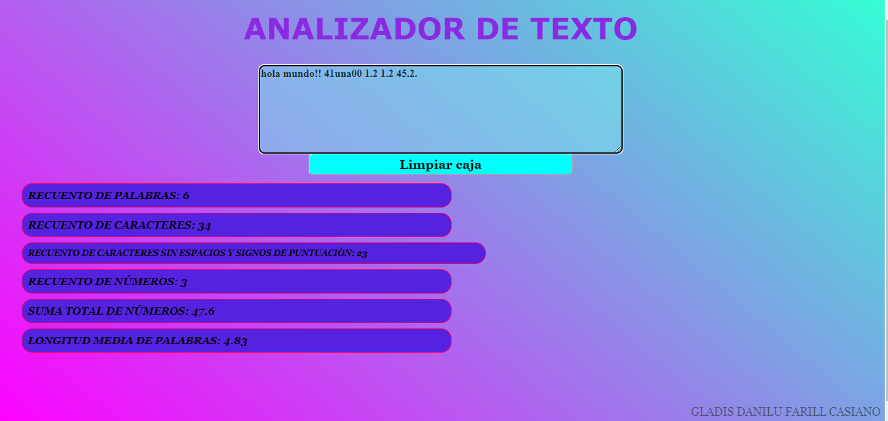

# **BIENVENIDO A TEXT ANALIZER 

## Introducción:

¿En qué consiste este analizador de texto? Como su nombre lo dice, consiste en analizar el texto que el usuario escribe dentro del cuadro de texto, el analizador realiza los siguiente:

*Cuenta la **cantidad de palabras** que ingresas, ejemplo: _Hola mundo (dos palabras)_.
*Cuenta la **cantidad de caracteres**, es decir las letras de manera individual, signos, espacios, etc., ejemplo: _Hola mundo (10 caracteres)_.
*

## ***ARCHIVOS QUE UTILICE***

## STYLE.CSS
aquí utilice
## INDEX.HTML
## INDEX.JS
## ANALYZER.JS

### USO DE LA APLICACIÓN
* Esta aplicación es apta para usarse en cualquier navegador, ya sea firefox, chrome, edge, safari y para abrirlo en cualquier aparato electrónico, computadora, laptop, telefono, celular.

